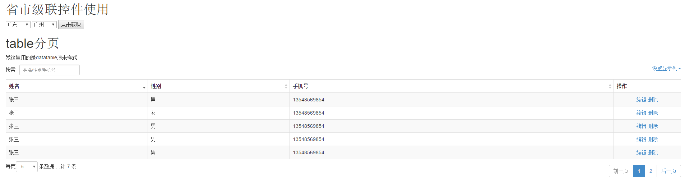

#项目说明
我接触vue有两周左右时间，对vue基本使用还是比较理解。两周的开发，项目也已告一段落，现在整理一下vue项目中用到的控件或插件使用。例子截图如下：

## 级联(v.location)
基于项目需要，暂实现省市两级联动，省市数据都在控件js json形式。

## vue-table (v.pager)
一开始，table的实现，用的是jquery.datatable，但是由于我自己用到vue双向绑定框架，如果将所有数据都罗列出来，然后用jquery.datatable执行，让其自己实现分页，搜索，但是项目业务需要分组涮选，而本人尝试过jquery.datatable异步获取数据，但是数据刷选之后，没办法重新刷新table。无奈之下，自己尝试写一个分页控件，用双向绑定方式实现jquery.datatable本来具备的功能：分页，排序，搜索。具体使用请看源码，可按照自己的需要提取相应的模块或代码。希望对vue使用的开发者提供到一点绵薄之力。

# 版本更新
## v1.0
新增省市级联控件，table分页排序搜索控件使用例子
